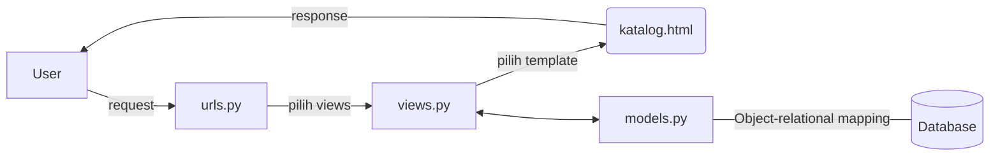

# Link Herokuapp
https://django-tugaspbp2raspati.herokuapp.com/katalog/

# Bagan request user ke web aplikasi berbasis Django

```mermaid
flowchart LR
    User-->|request|urls.py;
    urls.py-->|pilih views|views.py;
    Template(katalog.html)-->|response|User;
    views.py-->|pilih template|Template(katalog.html);
    views.py<-->models.py;
    models.py---|Object-relational mapping|id1[(Database)]
```
