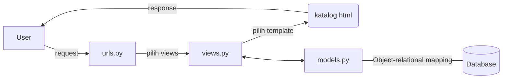

# Link Herokuapp
https://django-tugaspbp2raspati.herokuapp.com/katalog/

# Bagan request user ke web aplikasi berbasis Django

# Kenapa menggunakan virtual environment?
_Virtual environment_ adalah sebuah wadah untuk menampung pustaka serta modul dalam suatu proyek pekerjaan agar terisolasi. Dengan menggunakan _virtual environment_ kita mencegah terjadinya suatu error. Error tersebut disebabkan package dan _dependencies_ yang bertabrakan dengan versi lain yang ada di komputer. Walaupun tidak menggunakan _virtual environment_ kita tetap bisa menggunakan django, tetapi lebih disarankan untuk menggunakan _virtual environment_ agar kita bisa menjalankan aplikasi web dengan versi django berbeda-beda pada satu komputer.

# Cara implementasi
1. Membuat sebuah fungsi pada views.py untuk mengambil semua data dari json menggunakan syntax CatalogItem.objects.all() dan mengembalikan data tersebut ke template html menggunakan render().
2. Proses routing pada views.py dilakukan dengan caara menambahkan urlpatterns(path) pada urls.py dengan perintah path() (urls.py pada folder project_django dan juga pada folder katalog)
3. Setelah melaksanakan perintah loaddata(python manage.py loaddata initial_katalog_data.json)jason akan memasukkan data didalamnya ke dalam database django lokal, lalu dibuat sebuah variabel context yang akan menyimpan data tersebut. kemudian akan melakukan render dengan perintah render(_____, context)
4. Membuat new app di heroku lalu, lalu membuat 2 secret repo di setting repo kita bernama API_KEY dengan isi API key akun heroku kita  dan APP_NAME dengan isi nama aplikasi yg telah dibuat di heroku. Setelah itu kita tinggal re-deploy melalui github.
